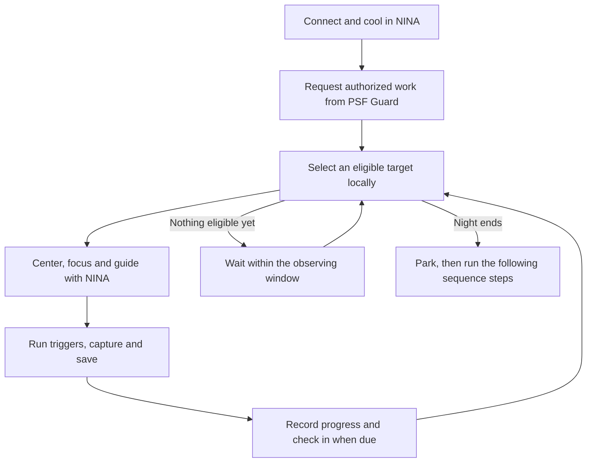
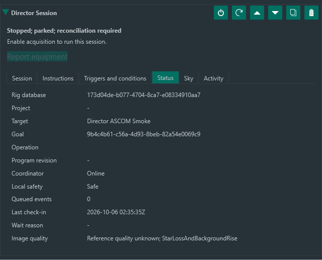
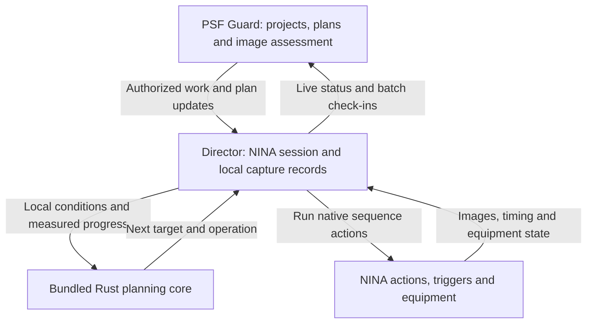

# PSF Guard Director for N.I.N.A.

**Plan in PSF Guard. Image in N.I.N.A.** Director runs your observing projects
through NINA's Advanced Sequencer. It chooses what to image next, prepares the
equipment, captures frames, and reports progress back to
[PSF Guard](https://psf-guard.com).

Director schedules locally using the same Rust planning core as PSF Guard. It
follows project priorities, target visibility, your horizon, Moon avoidance and
remaining exposure goals. It can keep imaging through a server outage within
the work already authorized, then check in when the connection returns.

*Director Session in an unarmed NINA simulator profile. Recovery settings shown
here are configured for that test; retries are off by default.*

## What it does

- **Schedules multiple targets locally.** Selects eligible work by priority and
  observing constraints instead of replaying a fixed list of exposures.
- **Uses NINA's imaging actions.** Slew and center, rotate, autofocus, guide,
  dither, flip at the meridian, capture and park using your connected equipment.
- **Fits into your sequence.** Use Director's automatic actions or your own
  NINA instructions, triggers and conditions in the target and exposure slots.
- **Shows what is happening.** Session status, a target altitude/horizon chart,
  and an action log show the selected work, waits, outcomes and elapsed time.
- **Checks in live or in batches.** Send rig status while connected and deliver
  recorded capture and preparation results during the night or afterward.
- **Keeps safety local.** Safety-monitor and roof status interrupt acquisition.
  Failed slews and uncertain operations stop the session; the default abort
  action parks the mount when enclosure clearance permits.

Target Scheduler is not required. Director is a separate plugin from
[PSF Guard Sync](https://github.com/theatrus/psf-guard-nina-plugin): Sync transfers
catalog data and images; Director runs acquisition. Installing Director does not
change Sync.

## Get started

Requires **Windows x64**, **NINA 3.2 or 3.3**, and a PSF Guard server
with Director support. The planning runtime is bundled with the plugin.

1. Add `https://nina-plugins.psf-guard.com/` as a source in NINA's plugin manager
   and install **PSF Guard Director**. See [releases](https://github.com/theatrus/psf-guard-director-nina-plugin/releases)
   for package versions. This README describes `main`; packaged features follow
   the release notes.
2. In Director's plugin settings, enter your PSF Guard server address and pair
   using a Director pairing code. Credentials stay in Windows Credential Manager;
   no API key is displayed.
3. Connect your equipment, add **Director Session** to the Advanced Sequencer,
   and configure safety, enclosure clearance, horizon and operation ownership.
   Keep acquisition disabled while setting up.
4. Use **Report equipment**, then review the rig configuration and commission
   its project work in PSF Guard. Each rig is bound to its project database.
5. Enable **Local target scheduling**, **Automatic workloads**, and finally
   **Enable acquisition**. Run the sequence to request work and start imaging.

Put connect/cool steps before Director and warm/disconnect steps after it in the
outer NINA sequence. Pairing and equipment reporting alone never start acquisition.
See the [setup and operation guide](docs/native-capture.md) for policy details.

## A night with Director

Safety and enclosure checks run throughout the sequence, not just between
exposures. A server outage does not disable local checks or grant more work.
When the current authorization expires, Director needs fresh server approval.

### Your instructions, where you need them

The seven slots are **Before Wait**, **After Wait**, **Before New Target**,
**After Each Exposure**, **After New Target**, **After Each Target**, and
**After Target Complete**. Use the native editors to add NINA instructions and
compatible plugin actions. Choose Director or Sequence ownership per operation
so autofocus, guiding and meridian flips have one owner.

### Recovery is your choice

Cloud screening, focus/guide retries, weather/roof recovery and settled-night
restart are **off by default**. The default is to stop for the night and park
when the enclosure permits it.

Optional recovery has time and attempt limits. Cloud screening can monitor,
stop for the night, or hold and take unsaved probe exposures. Its initial
reference keeps a **Reference quality unknown** warning: stable frames do not
prove a clear sky. Repeated autofocus or guiding failures can accompany clouds,
but Director stops on exhausted retries without needing a cloud diagnosis.

*Native NINA status-view render from the simulator test, with controlled quality
measurements. The unknown-reference warning remains visible after parking.*

Explicit restart is limited to recorded, settled night boundaries. It preserves
the original deadline and spent budgets, checks idle equipment and fresh safety
evidence, and requests new work. It cannot clear terminal stops or resume
uncertain captures or hooks. This mode currently excludes session-level and
inherited triggers/conditions; ordinary sessions retain those editors.
See [recovery and restart](docs/native-capture.md#native-quality-controls).

## How it fits together

PSF Guard and Director use the same planning code. NINA owns equipment actions;
Director does not need Target Scheduler internals or an always-online scheduler.
Local records survive disconnection, and repeated check-ins do not duplicate
capture credit or replay equipment actions. Check-ins transfer evidence, not
image files.

## Future work: AstroCollab

We plan to support [theatrus/astrocollab-api](https://github.com/theatrus/astrocollab-api),
an API for contributing observations to shared projects across rigs and sites.
**This integration is not implemented yet.**

The [proposed PSF Guard adapter](https://github.com/theatrus/astrocollab-api/blob/main/integrations/psf-guard.md)
would pair each rig, report its capabilities, and request suitable targets,
panels and filters at check-in. Director would use its existing local planner
and NINA actions to execute that work. A collaboration assignment would never
override local safety, equipment limits or acquisition permission.

PSF Guard would prepare and queue calibrated subs or requested masters for
submission, retaining capture and calibration provenance. Uploads would stay
off the exposure path, and remote assessment would appear alongside local
grades rather than overwrite them.

## Documentation and development

- [Setup, native actions, safety and check-ins](docs/native-capture.md)
- [Simulator validation and known test limits](docs/nina-smoke-test.md)
- [Build, test and package the plugin](docs/development.md)
- [Director architecture and roadmap](https://github.com/theatrus/psf-guard/blob/main/docs/design/director.md)

Cloud control flow has simulator coverage; real-sky cloud accuracy and arbitrary
crash recovery remain validation work. Test your equipment and safety policies
under supervision before unattended use.

## License

Apache-2.0. Copyright 2026 Yann Ramin (@theatrus).
