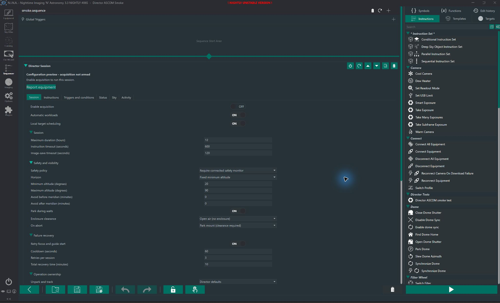
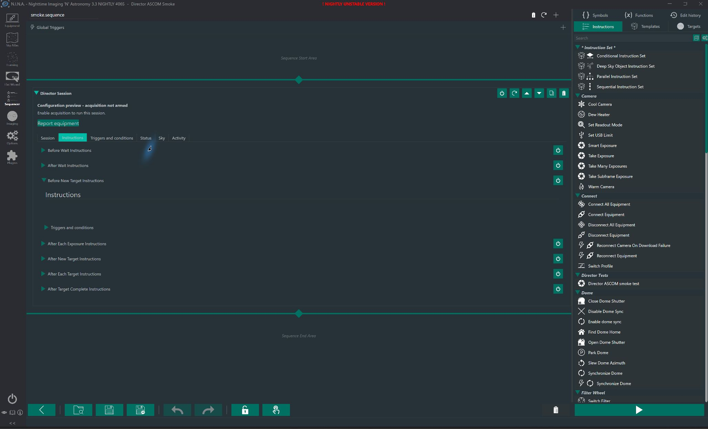

# Native capture adapter

## Central telemetry and batch replay

When status reporting is enabled, Director sends the current native operation,
monotonic elapsed time, goal, safety, wait/queue state and connected mount's
J2000 position in degrees. Reports expire after three reporting intervals,
bounded to 15 seconds through ten minutes. These are fresh snapshots, not a
replay of the local action log. Transport failures obey Allow Offline.

Live, end-of-session, settings Check In and the Director Check In instruction
also deliver the Rust preparation outbox to `POST /rigs/{rig}/operations`.
The server must support that endpoint before deploying this plugin increment.
Capture and preparation cursors are independent and scoped to the exact
coordinator/catalog/rig/profile/ledger tuple. Lost acknowledgements resend the
same receipts. Deferred mode keeps both streams local until an explicit batch
check-in. Neither stream is pruned by an acknowledgement, and batch replay does
not resend old live status or dispatch hardware.

Central history currently records shared-core preparation operations, including
aggregate Before Target duration. Nested focus/guiding/flip entries remain in
the NINA log and session action history; they are not separately durable central
receipts. Duration learning, complete hook instrumentation and quality-driven
park/retry remain future increments. Local paths and credential/device IDs are
not part of the telemetry projection.

## Native imaging defaults

Director ownership now uses NINA's native Center/CenterAndRotate, Run Autofocus,
Start/Stop Guiding, Restore Guiding, autofocus triggers and Meridian Flip trigger.
The shared Rust core still selects targets, issues preparation and decides dither
cadence. Preparation receipts record elapsed time and success/failure locally.
This adds no Target Scheduler dependency and does not change PSF Guard Sync.

For automatic imaging, connect and cool equipment using the outer NINA sequence,
review the resulting Director equipment report, and select Director ownership
for the desired operations. A configured focuser/guider must be connected when
Director owns it; choose Sequence for manual focus or an unguided setup. Native
focus runs on target entry and after filter changes, 30 minutes or 5 degrees of
temperature change. Native meridian settings remain in the NINA profile. Custom
cadences and optional plugin alternatives use Sequence ownership and the normal
slots/ancestor triggers. Known overlapping native actions fail validation.

Director stops guiding before centering, focuses before starting guiding, checks
native triggers before capture, and parks at shutdown. The seven instruction
slots remain active. Connect/cool and warm/disconnect are outer-sequence steps,
not hidden effects of the Session's Unpark/Track and Park settings. Dither uses
NINA's guider algorithm with a checked native Dither subclass: the pinned NINA
action discards a false result, which Director must treat as failure. Failed or
unfinished operations cannot credit preparation or silently start another frame.

### Meridian flips

With Meridian Flip owned by Director, the Session installs NINA's built-in
trigger. It evaluates the upcoming instruction duration and uses the active
profile's earliest/latest flip time, pause-before-meridian and pier-side rules.
NINA runs the flip workflow, including its before/after flip events, configured
autofocus, recenter, guiding and settling. Director does not issue an independent
flip command or implement a second timing policy. Sequence ownership leaves
your own native flip trigger in charge; duplicate native triggers are rejected
when Director owns the operation.

The adapter checks both the VM result and exposed workflow-step completion,
since the pinned NINA implementation can otherwise discard a false result.
A failed or canceled Director-owned flip cannot authorize another capture.
Activity and the NINA log record its start, outcome and elapsed time. After
inherited triggers finish, dispatch rechecks pointing, safety, current geometry
and allocation validity. The instruction timeout also bounds native flip waits;
set it long enough for your profile's pause and recovery workflow. The explicit
rig meridian exclusion remains a planning constraint, not permission to flip.
NINA treats some recovery operations (notably recenter and dome sync) as best
effort; a finished workflow is not proof of a new pixel-derived plate solve.

Native workload requests use `native_imaging_v1` for local multi-target work or
`native_single_target_v1` for one target. Older execution modes remain limited to
sequence-owned setup. A changed, unresolved request cannot upgrade/downgrade its
capability. Rotation requires native centering and a connected configured rotator.
Nominal preparation estimates are conservative initial budgets, not a learned
duration model; real elapsed time is checked before the next command/capture.

The Sky tab reuses NINA's AltitudeChart and the selected target's native horizon,
following Target Scheduler's display pattern. It is a local display, not a new
planner or a guarantee that Moon/meridian constraints permit an exposure. Activity
shows the most recent 200 planner/preparation/capture entries with outcomes and
elapsed milliseconds. The same entries go to the NINA diagnostic log; durable
operation receipts remain in the sidecar ledger. Neither display is launch authority.

## Live and Deferred Check-In

Session **Capture delivery** selects Live (the default) or Deferred. Live sends
bounded periodic and target-change batches during acquisition. Deferred keeps
capture evidence local until session-end check-in, an explicit **Director Check
In** sequence instruction, or **Check in** in plugin settings. Turn off
**Check in at session end** for deliberate manual/end-of-night delivery. Live
status telemetry is independent and is never backfilled as a current rig state.

**Check in at session start** first delivers saved runs for the current pairing.
The session duration limit includes this work. Session-end delivery drains the
backlog in bounded pages; cancellation preserves the last acknowledged cursor.
Automatic workloads always require terminal delivery before requesting another
grant, regardless of the delivery mode or session-end checkbox.

Each new acquisition records its original allocation, ledger identity, geometry
and initial state beside the ledger before one-shot launch. Saved-run delivery
reopens that exact ledger through the shared runtime; it never invokes allocation
start, reservation or equipment commands. Historical expiry and changed current
equipment do not prevent reporting the old evidence. Missing/truncated ledgers,
changed identities or corrupt records stop delivery instead of creating new state.
Run storage links are not followed. The acquisition lease excludes active sessions
and concurrent saved-run delivery. Put **Director Check In** before or after the
Session, not in its instruction slots; live target check-ins cover those boundaries.

After successful native parking and verification that no capture/preparation is
unresolved, automatic workloads persist a clean-completion receipt. If the server
is offline, a later check-in can confirm that terminal release. It records a past
completion, not current mount/rig telemetry, and never advances a newer pending
request. Ordinary workload intake reconciles the released request on its next
call. Aborted, uncertain or uncleanly shut-down runs cannot use this path to gain
fresh authority. A lost reply is retried with the same ledger/cursor, not a second
capture. Confirmed releases are recorded locally to avoid repeated release calls.

Scope is exact coordinator origin/instance, catalog, rig, NINA profile and paired
client. Re-pairing as a new client does not silently adopt another client's runs.
The archive is not a credential store. Only runs created with this feature have
the required check-in record; older prototype runs need explicit reconciliation.
This path delivers capture evidence, not image files, historical live telemetry,
grade revisions or automatic restart authority. Persistent observing-night
recovery and default focus/guiding/centering/flip policies remain separate work.

## Abort Policy

Director Session > Session > Safety and visibility > **On abort** selects
**Park mount (clearance required)** or **Stop slew and tracking (no park)**.
The choice is saved in the sequence and applies to operator cancellation,
unsafe conditions, session timeout and acquisition errors after launch. Older
sequences retain the park default. Normal completion still parks; **Park during
waits** controls planned waits separately. Aborted workloads are not released
as successful, and recovery never restarts the stopped owner automatically.

Parking always requires independent enclosure clearance. If the enclosure is
not clear, Director stops slewing and tracking without starting a park. A
failed, cancelled or timed-out park also attempts both stop commands. Failures
remain visible; Director never retries parking automatically or commands a
replacement mount/profile. NINA's tracking setter returns the resulting state:
`false` confirms tracking-off, rather than indicating command failure.
The park-failure latch is shared by planned waits and terminal cleanup, so a
failed wait park cannot cause another park attempt during shutdown.

## Bounded Focus and Guide Recovery

In **Director Session > Session > Failure recovery**, enable **Retry focus and
guide start** to retry known-completed failures in Director-owned target setup.
This is off by default. Set the cooldown (default 60 seconds), retries shared
by the observing session (default 3), and total recovery time (default 10 minutes).
The existing instruction timeout also bounds the complete target-setup invocation;
it can end recovery earlier. **On abort** chooses park or stop when recovery is
exhausted. Parking still requires independent enclosure clearance.

Retries use fresh native NINA autofocus/guide-start instructions. Guide failure
requires a confirmed native guider stop first; moving focusers, timeouts,
cancellation, disconnected devices and unknown outcomes cannot retry. Exposure,
slew, center, dither, user hooks and native trigger failures are not retried by
this setting. Native autofocus may have its own profile-level attempts, so the
session limit counts complete native instruction invocations, not focus sweeps.
The mount remains at the target during cooldown; this is not a cloud probe or a
park/unpark loop. The status and Activity log show the cooldown and spent budget.

The bundled Rust core persists the observing-night identity, immutable policy,
retry budget and stop state in one recovery directory per rig. Target switches,
new allocations, NINA restarts and turning the checkbox off cannot reset that
budget. For this first increment, a new Run cannot replace a recorded session
until its original **Maximum duration** window ends. Uncertain work still needs
reconciliation; the new night does not make an old allocation reusable. There
is no force-resume button. Recovery journal events are retained locally; capture
and preparation check-in do not yet upload that separate recovery journal.

These screenshots show an unarmed simulator profile in NINA 3.3.0.1065.
The requested next increment adds an explicit weather/roof **hold and resume**
policy with stable Safe/Open readings, interrupted-work reconciliation and new
core-issued commands. Cloud classification/probes and normal night-end
continuation are also pending. Current unsafe/roof interrupts still stop the
owner; this focus/guide option does not enable reopening it.

## Enclosure Clearance

The public Session requires an explicit **Enclosure clearance** policy under
**Safety and visibility**. New and older serialized sequences default to
**Not configured**; equipment reporting remains available, but acquisition is
blocked until the operator chooses a policy.

- **Open air (no enclosure)** is an operator declaration that no roof/enclosure
  obstructs the mount. NINA must have no configured or connected dome.
- **Require fully open enclosure** binds the exact active profile and dome
  device. Both current device state and a subsequent fresh broadcast must show
  fully open. A cached registration callback cannot establish freshness.

Closed, closing, opening, unknown/error, disconnected, stale or changed-device
evidence interrupts the owner and blocks further mount motion. The local
watchdog runs independently of the server. Reopening cannot clear this owner's
stop latch. Weather Unsafe still cancels acquisition, but permits shutdown park
only when independent enclosure clearance remains valid.

Shutdown skips new park motion without clearance, requests native slew-stop and
tracking-off independently, and reports **Stopped; enclosure blocks parking**.
Errors stopping the mount are logged and propagated, not treated as successful
parking. Clearance loss during a park cancels that operation and requests stop;
there is no automatic retry. Cleanup refuses commands to a replacement mount or
profile. Director never opens or closes the real enclosure itself.

This is sampled native evidence, not a physical roof/mount interlock. Drivers
must report truthful shutter state and honor abort/stop requests; independent
observatory hardware protection is still required. Arbitrary third-party
equipment clients are not excluded. The persistent observing-night recovery
weather-hold policy, cloud classifier and automatic probes remain pending.

## Session Recovery Client

Runtime 0.9.0 / IPC 9 exposes recovery contract 1 through the managed runtime
controller. The three-argument constructor takes the bundle, allocation ledger
directory and a separate existing per-rig recovery directory. Two-argument
callers keep recovery disabled. The public Session uses the three-argument
constructor when focus/guide recovery is enabled or a rig recovery directory
already exists. The managed
client verifies both recovery mode and version in the handshake.

Call `OpenRecoveryAsync` or `ReadRecoveryAsync` before applying events. The
night identity and policy are immutable; revisions and event time cannot move
backwards. `ApplyRecoveryAsync` transports shared-core decisions without
reimplementing quality or retry policy. Only a newly applied begin event can
return a matching probe/park suggestion with a bounded deadline and explicit
motion clearance. It is not a hardware permit. Retry and restart readback
never issue work. Cancellation after submission faults the session; reconnect
and read persisted evidence instead of guessing whether the event committed.

`ReadRecoveryEventsAsync` returns contiguous, bounded journal pages. Malformed,
foreign, missing or changed state faults the connection. Typed domain errors
remain visible without pretending the operation succeeded.

Native focus/guide recovery now admits a policy and observing night, persists
one per-rig recovery directory across allocations, supplies fresh safety and
**independent enclosure/mount-motion clearance**, and dispatches each original
suggestion once with fresh native checks. Remaining work must classify compatible
quality samples against a frozen reference and cancel/reconcile interrupted native
work before resuming a weather hold. The local
enclosure interlock now supplies separate clearance for ordinary acquisition
and shutdown. A safe weather monitor alone does not prove a roof is clear.
Do not enable recovery by adding the directory argument to the public owner
without those gates.

## Exposure Moon Avoidance

Runtime 0.8 / engine 0.3 enforces the explicit Moon policy carried by each
server recipe. Configure it in PSF Guard's exposure template library. NINA
does not implement a separate lunar scorer: the shared Rust core intersects
whole-operation lunar windows with the site's horizon, meridian constraints
and allocation limits. A blocked high-priority recipe cannot displace eligible
work. Equal-priority choices prefer the more Moon-sensitive recipe.

When only lunar rules block the remaining work, the session reports
`moon_avoidance`, runs the native wait slots and parks when **Park on wait** is
enabled. It keeps evaluating locally during a coordinator outage. A clean
preparation that outlasts its lunar window is closed before asking Rust again;
uncertain or failed native operations are never silently retried.

Automatic requests advertise `prepared_target_v3` or `local_sequence_v3`.
Ambiguous requests saved by the old plugin retry their original v1/v2 capability
until the server confirms waiting or release; they cannot switch scope during
recovery. Older non-lunar ledgers remain readable. Moon policies cannot use a
non-geometry ledger, and binding comparisons preserve exact JSON numbers.

Detailed lunar diagnostics and quality-pause recovery remain separate unfinished
phase work.

## Project ranking and live priority changes

Use **Project priority** in PSF Guard's planner to order projects globally, with
optional site or rig replacement orders. The server compiles that order into
shared-core priorities. NINA selects the highest eligible project locally,
including while disconnected; it does not implement a second scheduler.

With **Automatic workloads** and **Live** check-in enabled, a successful start,
target or periodic check-in also reads the current program preview. A changed
priority for the same goal set queues a handoff at the next settled boundary.
Progress-only revisions do not cause handoffs. Manual allocations and deferred
check-in keep their original order for the full allocation.

The handoff finishes the current preparation/exposure and its hooks, parks,
checks that no preparation or capture is unresolved, delivers the full capture
feed and releases the old workload. Only then can a newly commissioned grant
start. Pending images and spent attempts carry forward; no budget is reset.
An outage while executing retains the cached order. An outage during terminal
release leaves the rig parked with durable evidence for later batch check-in,
not permission to replay the old grant. This conservative handoff includes a
park/unpark cycle; uninterrupted tracking across grants is not implemented.

New/removed goals, configuration changes, grade corrections and arbitrary
weighted-policy edits are not live priority handoffs. Those remain part of
broader reconciliation. A preview that is not ready leaves the held grant in
place. Safety, expiry and enclosure policies retain authority over every step.

## Legacy observing preferences

Previously issued weighted programs and their stored settings remain supported.
New ranked programs omit those policies; the current planner does not expose
per-project importance or weights.

Legacy weighted allocations carry their resolved policy and source revisions. Runtime
0.10.0 / IPC 10 uses the shared geometry scorer offline; the plugin does not
implement its own ranking. The ledger preserves selected-goal time on restart.
One exposure's preparation retains its selection while rechecking hard limits
before dispatch. Safety, horizon, Moon, expiry and attempt budgets always win.
Old execution modes refuse weighted workloads. Settings edits affect new
allocations, never rewrite an existing grant, and policy dictionaries serialize
in ordinal key order so fingerprints stay stable across processes.

Continuity currently lasts within one allocation. A clean parked successor
starts without an active-goal context. Cross-allocation continuity, displayed
candidate scores and learned timing estimates remain backlog.

## Local target scheduling (experimental)

Enable **Local target scheduling** in Director Session to run multiple targets
within one admitted workload. The shared Rust core chooses the best eligible
goal using the allocation's legacy or weighted policy after each saved exposure,
and rechecks feasibility during native preparation, using
current NINA site, horizon, altitude, meridian limits and durable progress.
The adapter resolves that goal's target and recipe; it does not rank targets.

Put native inherited-coordinate slew/center, autofocus and guiding instructions
in **Before New Target**, with their ownership set to **Sequence**. Director
unparks and enables tracking before entering that slot. Target switches run
**After New Target**, **After Each Target**, then **Before New Target** with the
new target's context. Each confirmed save runs **After Each Exposure**. A wait
ends the visit; returning runs setup again. Saved images are pending quality
assessment, so they do not fire **After Target Complete**.

Target setup runs as a core-issued, one-shot preparation operation with its
actual duration retained in the local ledger. After a slow hook, Rust can halt
unused preparation and select a newly eligible higher-priority goal. Unknown or
failed hooks stop the session, rather than replaying hardware operations.
Reported mount pointing must match the selected target within three arcminutes
before reserving/capturing; this is not a pixel solve.

Target and periodic capture check-ins use a bounded background pump. An offline
server does not block a local target switch. Final check-in/park/release still
must finish before a new workload is authorized. First launch remains online;
offline execution stays inside that workload's original expiry and budget.
Use **Automatic workloads** independently to renew work after clean release.
Its capability request is `local_sequence_v1`, while existing single-target
sessions keep `prepared_target_v1`. An outstanding request cannot change modes.

This is not full TS operation-policy parity: automatic centering, focus,
guiding, dithering, flips, learned duration estimates, feedback revisions and
offline cold-start recovery remain unfinished. Target setup is sequence-owned.
Acquisition and local scheduling stay off by default, preserving old sequences.

## Public prepared-target mode (experimental)

### Automatic workload intake

Enable **Automatic workloads** after the operator
reviews equipment and commissions a workload policy on PSF Guard (meta schema
18). This is an API-only commissioning step for now; see the server's Director
management guide. It selects the exact pairing/profile/configuration and active
projects, not a second rig database.

Director persists a request UUID before contacting the coordinator and retries
the same request after lost replies. It executes the shared Rust core's choices
within the issued grant. After successful hooks, capture delivery and parking,
it checks there are no unresolved operations, seals the workload and requests
another. Pending quality assessment produces a visible, bounded wait, not more
captures. Each grant still uses one-shot launch; an ambiguous launch response
must not be retried.

Offline acquisition can continue within an already running grant, but offline
completion leaves it outstanding with local receipts. Failed shutdown, capture
or preparation uncertainty, changed configuration and revoked credentials stop
renewal. Keep the local state for reconciliation. There is no automatic restart
recovery, rejected-image feedback or attempt-budget increase yet. Manual
allocations cannot be switched into this release protocol retroactively.
Without **Local target scheduling**, this mode still requires one prepared
target. Both can now use the native imaging defaults described above.

`Director Session` can opt in to prepared-target acquisition. It requires the
server's one-shot allocation-start API, online first launch, a connected safe
monitor, matching commissioned equipment/site/horizon, and dated NINA IERS
data. Sequence files cannot store launch authority. Lost launch responses and
restarts require reconciliation; this mode never reuses a consumed allocation.

Enable acquisition in the Session tab. Select **Director** for native imaging
defaults or **Sequence** for operations supplied by normal NINA instructions,
hooks or plugins. Keep **Director** for unpark/park. The executor requires reported
pointing within three arcminutes and tracking before exposure; this check is
not plate-solve evidence. Rotation needs native centering and the bound rotator. Unsupported
policies fail validation, not silent fallback.

The shared core selects recipes and owns preparation/capture budgets. Native
exposure instructions inherit sequence triggers/conditions; all seven named
slots remain available. Director handles unpark with native sidereal tracking,
filter/readout preparation,
correlated image saves, local journals, batch check-in and optional live status.
It parks on shutdown and, when selected, on waits. Pending assessment ends the
bounded run without declaring the target complete. Offline continuation applies
only to an already admitted running process, never an offline cold start.

Only one local Director session can own equipment. NINA must remain the sole
hardware controller; this lock cannot exclude arbitrary external applications.
Clock discontinuity, stale/unsafe monitoring, profile drift and failed native
operations stop acquisition. Authentication failures never become offline
fallback. Preserve the local acquisition directory for reconciliation.

The historical sections below describe the adapters' earlier validation gates;
the public increment does not remove gates for automatic operation policies,
resume/successor accounting, duration learning or pixel-verified pointing.

This is the internal acquisition building block for Director's session
container. It is not exported to N.I.N.A.'s sequencer or MEF and has no settings
button. It does not select goals, retry exposures, or replace the Rust planner.

## N.I.N.A. contract

The adapter targets `3.3.0.1058-nightly`, source commit
`516039556050dde4c0820a486fbc75217e3804f3` from the published NuGet metadata.
It uses public interfaces only:

- `IImagingMediator.CaptureImage` for exposure and download.
- `IExposureData.ToImageData`, `IImagingMediator.PrepareImage`, and image history
  for N.I.N.A.'s normal preparation and display.
- `IImageSaveMediator.Enqueue`, `ImageSaved`, and `ImageSaveFailed` for saving.

Enqueue only admits work to the save queue. It does not confirm a file on disk.
The adapter subscribes before enqueue and waits for a matching final receipt.
Both the N.I.N.A. image ID and Director's `PGCAPID` metadata value must match.
An unrelated image cannot complete the attempt. A save failure propagates to the
caller rather than becoming a successful exposure.

The native save worker reads the active profile when dequeuing. Director wraps
`IImageData` to retain the original destination, filename pattern, format, and
compression settings while keeping N.I.N.A.'s queue, events, custom patterns, and
writer. Each write receives a fresh settings copy, including native retries.
The capture supports FITS and XISF lights; it does not silently produce TIFF or
RAW output that PSF Guard cannot catalog. The final path comes from the save
receipt, not a filename prediction or the event's profile-dependent file type.

The caller must prepare filters, focus, pointing, and other operations before
asking the Rust core again. Capture does not request a filter change. The
mandatory asynchronous dispatch callback returns a one-use synchronous guard.
The adapter calls that guard after its local validation, progress reporting and
durable `Capturing` marker, immediately before entering NINA. Profile and camera
identity are checked before and after that callback and before enqueue. The
adapter rejects concurrent calls rather than queuing another stale decision.

These checks are not sufficient to enable autonomous dispatch. A session must
own equipment against competing controllers, bind cancellation to local safety
and profile/session lifetime, and enforce eligibility at the actual hardware
boundary. N.I.N.A.'s imaging mediator can itself wait behind another capture;
calling the adapter is not proof that the shutter started at that instant.

## Issued allocation intake

`CoordinatorAllocationClient` reads the separate `/rigs/{rig}/allocation`
endpoint. An interactive PSF Guard operator must first admit the reviewed
preview for that exact paired client/profile. The issued snapshot has a distinct
`allocation-{uuid}` assignment identity and immutable original budgets/validity.
Program previews cannot be substituted for it. Existing pairing scopes do not
grant admission; a second client for the same profile cannot fetch the grant.

The client validates scope, configuration, ancestry links, size and expiry using
the existing strict transport/program decoder. It never requests admission and
never falls back to cache on HTTP failures. `CoordinatorAllocationCache` stores
the envelope atomically, bound to origin, coordinator, catalog, rig, profile and
client. Configuration changes cannot choose a fresh cache. Changed snapshots or
replacement IDs are refused even after expiry. Read requires current validity;
the cache contains no credentials and is not itself a hardware permit.

The isolated simulator operator admits the first allocation, retries admission,
and uses the paired client/cache to feed the existing Rust ledger. Outage,
restart and receipt tests require that allocation to stay byte-equivalent after
normal previews change their pending counts. Public prepared-target mode adds
exclusive local ownership, a one-shot server launch bound to a new ledger,
clock continuity and explicit narrow operation policies. It does not support
restart/resume or successor accounting.
There is no renewal/replacement API; never delete allocation evidence to mint
another budget. Offline revocation is bounded by validity, not immediate.
Check-in/status change hints use the allocation's source `PreviewRevision`;
capture events carry the allocated assignment ID. Do not compare a mutable
preview revision to the new allocation snapshot revision or silently replace the
grant when the server reports a plan change.

## Local safety and Earth orientation

`NinaSafetyInterlock` subscribes to NINA's safety mediator and binds the exact
profile and monitor. Only device broadcasts refresh evidence; a boolean Safe
event or reading the mediator's cached object cannot renew it. Evidence expires
after three polling intervals (at least five seconds), with polling above ten
seconds refused. A local watchdog checks every 250 ms, independently of HTTP.

Arming requires fresh connected Safe evidence. Unsafe/disconnected/changed or
stale evidence cancels the owner permanently, including updates that resume
after sleep and backward clock movement. A profile-change event invalidates an
unarmed owner too. The native session links this token to its operation lifetime;
Safe returning cannot resume old work. Cancellation callbacks run outside the
monitor's lock and cannot throw through NINA's broadcasting thread.

`NinaEarthOrientation` reads `%LOCALAPPDATA%/NINA/NINA.sqlite` read-only, without
initializing, migrating, or downloading data. It requires three consecutive
daily IERS rows around the midpoint of an assignment of at most 24 hours, checks
their dates/MJD and ranges, and converts native polar-motion arcseconds to
radians. Missing data fails; NINA's nearest-row/zero-fallback helpers are not used.

IPC 8 accepts one fixed EOP value. The reader binds the middle sample over the
requested span only when adjacent samples differ by no more than 2 ms UT1 and
0.01 arcseconds per pole component. This is a daily approximation with measured
sample drift, not an interpolation or a proof of intra-day error. Sample
provenance is retained. Discontinuities require updated evidence or a future
time-series contract; they never widen validity or replace a ledger's binding.

The simulator uses both adapters, including an unsafe transition interrupting a
native wait. The public container remains blocked: production admission must
bind these sources and define the shared core's conditions horizon separately
from monitor freshness. A fresh Safe observation is not a forecast that an
entire long exposure will stay safe. Continuous cancellation, safe shutdown,
uncertain-capture recovery and explicit restart admission remain required.

## Capture evidence

Before dispatch, the adapter reserves
`<journal-root>/<profile-guid>/<capture-guid>.json`. The caller supplies an
absolute Director-owned journal root, not a server-provided path. Existing
capture IDs cannot be reused, including failed or uncertain attempts. JSON is
bounded to 64 KiB, flushed to disk, and atomically renamed in the same directory.
An unwritable journal prevents dispatch. A failed final journal write does not
return a successful result.

Schemas 1 and 2 are experimental host evidence, not the final IPC/event contract. They
records rig/configuration, profile, assignment/revision, goal, camera, target,
requested exposure, destination, UTC timestamps, and observed state:

| State | Meaning |
| --- | --- |
| Reserved | The attempt identity is durably claimed. |
| Capturing | Dispatch is intended; a crash here does not prove whether hardware ran. |
| CaptureUncertain | Capture returned no usable result or was interrupted after dispatch. Hardware may have exposed; recovery is required. |
| Downloaded | N.I.N.A. returned a frame and image ID. |
| SaveQueued | Save admission is being attempted or completion is still unconfirmed. |
| Saved | A matching final file receipt was observed and recorded. This is not a grade. |
| Failed | An operation or explicit save failure was observed. No retry is authorized. |
| Interrupted | Cancellation occurred before save admission. A capture may have occurred. |
| SaveUncertain | Cancellation, timeout, or an unconfirmed error followed save admission. A file may still appear. |

The adapter preserves downloaded image identity even when cancellation arrives
before processing. It writes the stable Director capture GUID into FITS/XISF
metadata as `PGCAPID`, alongside normal N.I.N.A. target metadata. Input RA is
explicitly in degrees; the N.I.N.A. coordinate object converts it to hours.

A final guard refusal after the `Capturing` marker but before the native call
records `Failed` or `Interrupted`, because this running process knows it never
entered hardware dispatch. A crash at the same durable marker remains ambiguous;
it never authorizes replay. Once the native call is entered, failures remain
`CaptureUncertain` even when the call throws synchronously.

Elapsed times use a monotonic clock. Capture/download time excludes preceding
authorization/journal work; processing/save time starts after download; total
attempt time includes host overhead. These intervals are nested, not additive.
Exposure and download are not separately timed yet because `CaptureImage`
returns them as one operation. No timing estimator or second C# scheduler is
introduced here.

### Bound native recipes

The internal `NinaProgramCapture` adapter maps a validated Rust capture binding
to native exposure seconds, binning, gain, offset, and ICRS target metadata.
It requires a matching newly created reservation with a GUID capture ID.
Existing, recovery, saved, or mismatched attempts cannot enter this path.
A binding lookup alone is never authorization. The caller must still provide
fresh dispatch validation and own the equipment and session lifecycle.

The adapter rereads the full native configuration before creating the intent
and after the dispatch callback. At the latter boundary it verifies the prepared
filter slot/name, a stationary wheel, and `ReadoutModeForNormalImages`. NINA's
LIGHT exposure uses that setting, not the currently active `ReadoutMode`.
Preparation must set it through `SetReadoutModeForNormalImages`; capture does
not insert filter, readout, autofocus, or other preparation operations.
Supported gain and offset require explicit values. Native `-1` sentinels are
used only for controls declared unsupported by the validated configuration.

Bound captures write schema 2 journals with ledger, target, recipe, stable
filter, and requested readout identities. Schema 1 journals remain readable.
An unspecified position angle stays null in the journal and uses NINA's NaN
metadata sentinel, not a fabricated zero-degree rotation. The host journal is
still separate from the Rust ledger; the production container must coordinate
outcomes and recovery. No automatic retry or ledger refund is introduced.

Tests connect a real Rust prepared reservation and binding to mocked native
capture/save mediators, then record the saved outcome in Rust. They also cover
configuration drift, readout selection, wheel state, unsupported controls,
fixed filters, and old journals. These are not the full NINA/server simulator
gate. They do not prove that a camera driver applied a requested setting, nor
remove the imaging mediator's internal queue delay or competing-controller risk.

## Read-only coordinator intake

`CoordinatorProgramClient.ReadPreviewAsync` reads the current
`GET /api/director/v1/rigs/{rig}/program` compiler response. It requires an
explicit coordinator/catalog/rig/local-profile binding and the complete current
native configuration. The client preserves reverse-proxy URL prefixes, checks
all three returned identities and exact configuration, and verifies goal links
against the program's target/recipe bindings. Program schema 1 is understood;
the response currently carries no engine-version negotiation. Shared-core
domain validation and authorized ledger activation are still separate work.

Only HTTPS and loopback HTTP are enabled by default. Remote cleartext HTTP
requires explicit caller opt-in. URLs cannot contain credentials, queries or
fragments. A caller-owned credential provider supplies a bearer token in memory
for each request; there is no token setting, file, environment variable, URL or
log entry. The client does not follow redirects or accept cookies. Provider,
transport and server failures return bounded failure categories, not raw server
bodies, credential exceptions or local paths. Anonymous requests remain possible
for an isolated server configured to allow them. Paired clients also send the
bound local profile in `X-PSF-Director-Profile`.

The entire exchange, including credentials and body streaming, has a 30-second
deadline and caller cancellation. Response bodies are limited to 1 MiB and the
program to the core's 256 KiB request bound. Unknown/missing/duplicate fields,
null array entries, incompatible schema, wrong ETag and expired/future validity
are refused. Integer revisions and timestamps retain their full unsigned range.
These transport bounds do not prove that a complete future IPC operation fits.

The result is a `CoordinatorProgramPreview`, never acquisition authority. The
client sends unconditional GETs and rejects `304`: the current compiler does
not provide an immutable, cache-revalidatable allocation. Passing the prior preview checks that the same
ETag or assignment ID/revision never changes content, including validity.
This intentionally rejects the current server's rebuilt validity under an
unchanged identity. A genuinely different preview does not replace a ledger,
refund attempts or reset pending credit. The caller must not discard the prior
identity check to turn a refresh failure into an acquisition workaround.

`CoordinatorPreviewCache` atomically saves bounded inspection history with its
origin, coordinator/catalog/rig/profile tuple, exact configuration and content
fingerprint. `ReadAndCachePreviewAsync` loads that history before fetching and
checks immutable identity again before replacing it. Corrupt history is an
error, not permission to drop the guard. `ReadPrevious` can return expired
history for inspection and comparison; it never authorizes offline equipment.
The cache contains no credential. The existing TS-style container and Sync
surfaces are unchanged.

### Director pairing

Settings accept a server URL and a Director `psfdpt_` pairing code only. An
operator issues this code through PSF Guard's Director pairing API, scoped to
the exact rig database. The plugin exchanges it at `POST /api/director/v1/pair`
with protocol 1 and the local NINA profile GUID. It verifies the returned
coordinator/catalog/rig/profile/client identities and exact program-read,
checkin-write and status-write scopes. Sync codes and tokens are not compatible.
The credential and its binding are stored together in Windows Credential
Manager under a Director-only origin/profile key; no secret goes into NINA's
profile XML, arguments, environment or logs. Codes are cleared after use.

HTTPS and loopback HTTP work by default. A bare IP is treated as HTTP; a bare
hostname defaults to HTTPS. Non-loopback HTTP needs explicit consent, saved for
that exact origin in the current profile. Changing origins does not carry that
consent forward. Pairing changes require a stopped/faulted runtime and profile
changes cancel pending pairing. A configured but unpaired coordinator cannot
silently start with a random local rig identity.

Reset pairing deletes the local credential, not server authorization. Operators
can revoke old clients on the server. If a credential is deleted manually,
reset remains idempotent and a new code enables Pair without restarting NINA.
Lost exchange responses or vault write failures require a new code. The server
UI for issuing/revoking Director codes is separate frontend work.

### Capture checkpoint delivery

`CoordinatorCheckpointClient.DeliverAsync` reads the already-open runtime's
capture feed in pages of at most 64, posting to the exact bound rig's `/checkin`
endpoint. One call handles at most 16 pages by default (configurable, bounded).
Each page has a 30-second deadline including ledger read, credentials and HTTP.
There is no unbounded retry or preparation-feed mixing. This API is wired into
the test-only simulator probe, not an automatic production polling loop.

The local cursor is scoped to origin, coordinator/catalog/rig/profile and full
ledger identity. Writes are flushed and atomically renamed; a cross-process
lease prevents concurrent cursor replacement. Acknowledgements must match all
identities, receipt outcomes/counts, conflict sequences and contiguous progress.
Only the submitted page advances locally, even if the server knows later events.
Conflicts, malformed replies and partial failures never advance that page or
erase evidence. A lost response replays identical events and accepts duplicates.
The last observed program revision persists with the cursor, so a later page
failure cannot hide a required refresh on restart. Supplying that newly held
revision acknowledges the refresh; no response replaces a runtime ledger.

All capture/preparation evidence stays in the original ledger. The server
currently accepts capture events only; a separately identified preparation feed
is still needed. Production session ownership, authorized immutable allocation
activation/replacement, engine negotiation, automatic/batch check-in sequencer
controls and live-status reporting remain future work. The real NINA/server
receipt smoke test does not prove the server-issued acquisition acceptance gate.

## Planner evaluation

`RuntimeController.EvaluateAsync` sends an immutable `PlannerRequest` through
the bundled Rust sidecar. Its nested records and immutable arrays represent the
shared core's assignment, goals, eligibility intervals, transit coverage, and
local state. C# does not select priorities or implement window policy.

Requests use contract 2 with exact unsigned integers, including revision and
Unix-millisecond fields. Serialization and the 256 KiB core request limit are
checked before entering the session queue. The assignment rig must match the
negotiated runtime rig. Evaluations and heartbeats share one serialized pipe and
strictly increasing request IDs. Each admitted exchange has a five-second
deadline; shutdown and profile/runtime replacement cancel in-flight evaluation.

Replies must match the IPC session/request, engine/contract versions, and
assignment identity/revision. The decoder rejects unknown, duplicate, missing,
or incorrectly typed response fields, unknown actions/errors, and acquisition
of a goal absent from or ambiguous in the supplied snapshot. A valid core error
has no decision and leaves the session usable. Malformed transport/replies,
timeout, or cancellation after admission invalidate the session; no old decision
is replayed. Bad caller input and cancellation before queue admission do not
tear down another request.

A `PlannerEvaluation` is a recommendation for its snapshot, not a durable or
reusable authorization token. Production dispatch still needs a session-owned
state generation, durable attempt/event accounting, recovery, and independent
local safety enforcement at the actual equipment boundary. The simulator probe
now uses the durable bound program path below: Rust rechecks the boundary when
reserving after preparation. Its dispatch callback checks the local fixture and
reserved evidence, not a new stateless recommendation. This does not solve the
imaging mediator's possible internal queue delay.

## Durable ledger host

Runtime 0.7.0 / IPC 8 provides opt-in persistence through
`RuntimeController(pluginDirectory, storageDirectory)`. The caller must supply
an existing absolute, private, local Director-owned directory, scoped to its
rig/profile and allocation. Do not accept this path from a server assignment.
The sidecar exclusively owns the directory and its SQLite ledger until exit.
The ordinary settings preview remains stateless.

`OpenLedgerAsync` binds an immutable allocation to that ledger. `ReserveAsync`
asks Rust to project durable progress and select work atomically. Results
distinguish a new reservation, an existing attempt, recovery of another unresolved
attempt, and a non-acquisition planner decision. No result is a hardware permit.
An existing or recovery result must never cause an automatic capture retry.
Stateless `EvaluateAsync` is refused once a ledger is open.

`RecordAsync` accepts saved, failed, or uncertain observations. Saved means an
image exists, not that grading accepted it. `FindAttemptAsync` recovers evidence
by capture ID; `ReadEventsAsync` returns up to 64 events with a stable ledger
identity and next cursor. The host validates allocation/rig/configuration,
versions, capture/goal identity, strict fields, and contiguous event sequences.
It preserves unsigned 64-bit revisions and durations exactly. A returned storage
error is typed and carries no successful value. The host does not change retry,
credit, or recovery policy in C#.

All ledger calls share the heartbeat queue and five-second exchange deadline.
Malformed replies, disconnect, timeout, or cancellation after admission invalidate
the session. A lost reply may follow a committed write: reconnect and inspect
the same ledger/capture identity; do not replay equipment work or create a new
capture ID to bypass uncertainty. Caller errors and cancellation before admission
do not invalidate another request.

Tests exercise real Rust sidecars with isolated ledgers, abrupt process exit,
exclusive ownership, uncertain-to-saved recovery, duplicate observations,
pending credit, allocation mismatch, event pagination, and adversarial replies.
This is a host API, not a completed native acquisition integration. The adapter
still uses its separate host journal. Before connecting it, the shared core
needs reservation-aware operation/dispatch revalidation and session fencing;
opening a ledger and then using stateless evaluation is not a valid substitute.

N.I.N.A. remains the only execution backend in scope. The production Director
container must preserve TS-style options and normal sequence triggers, conditions,
and cancellation while the shared core owns operation policy. These host tests
do not establish native container or TS behavioral parity.

### Preparation and recovery host

`OpenProgramAsync` opens a program-bound ledger with the full immutable
allocation, target/recipe bindings, and equipment capability snapshot. It cannot
adopt an existing unbound ledger. `BeginProgramPreparationAsync` supplies local
observations and estimates, not replacement settings or progress counters.
`AdvanceProgramPreparationAsync` and `ReserveProgramPreparedAsync` require the
complete refreshed configuration at each boundary. Rust validates capability
ranges, resolves bindings, and owns scheduling and preparation policy.

`FindCaptureBindingAsync` retrieves the saved target, recipe, configuration, and
attempt. The host checks every field against the opened immutable program,
including array contents and exact integer coordinates/timings. Preparation
commands, recovery records, and preparation events are also checked against
their program binding. An unknown capture returns an explicit null binding.
No lookup, existing reservation, or recovery command authorizes redispatch.
Malformed replies invalidate the session; a typed `InvalidProgram` or changed
configuration error does not. Opening errors leave room for an exact retry.

The original unbound APIs below remain available for isolated legacy tests;
the runtime rejects their begin/advance/reservation commands on bound ledgers.
The production container must use the bound APIs, a matching sidecar bundle,
and fresh native dispatch checks. This host does not yet export actual NINA
capabilities through a production container or connect the native capture journal to this durable ledger.

### Native equipment snapshot

The internal `NinaEquipmentSnapshot` reader copies capabilities from the supported
camera and filter-wheel mediators and the active profile's filter definitions.
The local binding supplies explicit stable filter IDs and wheel slots. Names
detect edited mappings; they do not establish remote identity. A wheel-free
profile requires an explicit single fixed filter.

The snapshot contains binning pairs, readout indices, gain and offset ranges or
discrete values, and conservative whole-millisecond exposure bounds. Unsupported
controls are explicit. Missing, ambiguous, disconnected, subframe, or
unrepresentable configurations fail instead of acquiring with invented defaults.
NINA's ASCOM adapter can optimistically advertise writable gain before it has
ever attempted a write. Its exact absent-control state (unreadable gain, empty
gain list, and both limits `-1`) exports an unavailable control, never a guessed
range or a write to probe support. Other inconsistent ranges still fail.
The configuration digest includes profile/device identity, driver versions,
readout order, filter mappings, capture options, and the caller's constraint
revision. Raw device paths are not exported. Capability sets are copied into
immutable arrays and bounded to 256 entries.

Two copied reads detect changes during export. This is not a hardware lock or
permission to dispatch; the production executor must refresh the snapshot at
each operation boundary. A configured driver identity does not attest a physical
camera serial number. The site/horizon reader supplies the constraint revision,
including same-path horizon changes, as described below.

Regression tests validate a native snapshot with the real Rust program validator.
The isolated ASCOM probe records the connected simulators' capabilities and
checks that their identity survives three captures. It binds those capabilities
to a durable fixture program and checks saved progress after a sidecar restart.
It is not a production session or server allocation.

### Native constraint snapshot

`NinaConstraintSnapshot.Refresh` exports the active profile's site coordinates,
native flip settings, the explicit rig before/after meridian exclusion, minimum
altitude, and complete horizon breakpoints. Native flip/pause behavior remains
separate from hard rig exclusions. This adapter exports data, not observing
windows or a second scheduler. Rust visibility calculation and composition with
project preferences still need implementation.

The caller must persist an explicit `RequiredFile` or `FixedMinimum` declaration.
An empty NINA file path does not disable a previously required horizon. The
internal API rejects a missing, cleared, changed, malformed, or oversized file.
Fixed-minimum mode requires both the NINA path and loaded horizon to be empty.
There is no production settings UI or persisted declaration store yet.

Refresh bounds file size and point count, then locks the file against writes
and renames while calling NINA's public `ChangeHorizon` API. This controlled
reload synchronizes NINA's model with the exact exported bytes, including edits
that preserve the path, size, and modification timestamp. Call it only at a safe
refresh/check-in boundary, not for each UI repaint. It emits NINA's normal
`HorizonChanged` event. Do not recursively call Refresh from that event.

Standard files contain azimuth/altitude pairs; `.hpts` files contain JSON
altitude/azimuth pairs. Format selection matches the pinned NINA version,
including its case-sensitive extension check. Breakpoints use degrees with
azimuth north=0, east=90. Curves use linear interpolation, NINA's nearest-endpoint
completion when 0/360 are missing, and modulo-360 query wrap. Explicit unequal
0/360 endpoint values are retained. Duplicate azimuths use the last value as
NINA does. Every breakpoint is retained; export never samples a coarse grid.
The adapter checks knots, segment midpoints, wrap, and extrema against the
fresh native model. Invalid lines that NINA might skip are rejected by Director.

Profile/location/horizon events increment a local invalidation generation.
Profile changes and unexpected events during refresh reject the snapshot;
Dispose removes subscriptions. Generation alone does not detect disk edits:
Refresh must reread the file at each controlled boundary. The content digest,
profile, site, horizon, minimum altitude, rig exclusions, and native flip settings
feed a versioned constraint revision used by the equipment identity. Paths stay
local. This is not a hardware permit, filesystem watcher, or local safety monitor.

The isolated ASCOM probe reads a fixture horizon through the real profile
service and verifies a same-path edit reaches both NINA and the configuration
identity. It still uses unrestricted fixture eligibility for capture; this
test does not prove horizon enforcement during acquisition or server parity.

`EvaluateLedgerAsync` requests a read-only decision using durable progress,
without reserving an exposure. `FindUnresolvedAttemptAsync` and
`FindActivePreparationAsync` discover interrupted work after a lost reply or
host restart; callers do not need to have remembered its ID in memory.

`BeginPreparationAsync` binds the resolved target/recipe/equipment context and
blocking estimates. Rust decides native operation order. `AdvancePreparationAsync`
returns a newly issued `Run`, existing `InFlight`, `ReadyToReserve`, or a planner
decision. Only `Run` represents a newly issued operation, and it still requires
independent local safety, profile, configuration, target/recipe, and native
sequence-lifecycle validation at dispatch. A recovered record's `Pending`
command is evidence, never permission to repeat an operation.

`CompletePreparationAsync` records the operation ID/ordinal, outcome, wall-clock
end, and measured monotonic elapsed duration. It verifies the returned receipt
exactly, including 64-bit timings. Outer hook durations already include nested
work; do not add child durations again. The host never advances counters or
chooses the next operation itself. Failed and uncertain receipts stop progression.

`ReservePreparedAsync` asks Rust to refresh the final boundary and atomically
link the preparation to a capture reservation. Existing reservations remain
non-dispatchable. `ClosePreparationAsync` cannot discard a pending or uncertain
operation; closing an already captured preparation returns its captured evidence
unchanged. It does not reset or refund that capture.

`ReadPreparationEventsAsync` returns at most 32 events. Keep this cursor separate
from `ReadEventsAsync`'s capture cursor. The decoder checks strict fields,
allocation/rig/configuration/engine identity, contiguous sequences, native
receipt identities, record lifecycle consistency, and known goals. New typed
domain errors preserve the connection; malformed replies invalidate it.
IPC 3 hosts and IPC 4 runtimes cannot negotiate a session.

The plugin tests use the pinned CI-built runtime and terminate it after issue,
then reopen the same ledger and verify no redispatch, idempotent receipts,
prepared reservation, pending-image accounting, and separate event cursors.
These tests do not execute equipment. Authoritative recipe/configuration binding,
the native N.I.N.A. container, server allocation/check-in, and the full-stack
simulator gate remain required. The published 0.1.0.0 preview remains unchanged.

## Native preparation lifecycle

`NinaPreparationItems` creates internal, transient native unpark, filter, and readout
items from a newly issued Rust `PreparationNext.Run`. It rejects recovered
in-flight operations, mismatched recipe bindings, cloning, and native retries.
Resetting a NINA item cannot reset its one-use dispatch fence. Fixed-filter
configurations use a checked no-op rather than moving a wheel.

Unpark requires an explicit local telescope binding and a connected matching
native mediator. The configuration fingerprint includes the bound mount identity,
driver version, and public capabilities, but not changing park/tracking/position
observations. Legacy camera-only fingerprints remain unchanged. Refresh rejects
changed profile selection or disconnection. The native `UnparkScope` item retains
NINA's dome/shutter gate and unpark events. Success requires the requested mount
to report unparked and idle; false returns or contradictory post-state remain
uncertain and cannot advance the ledger. No mount is inferred from its name.

The native container still owns condition checks and inherited before/after
triggers. Inside `Execute`, after before-triggers have run, the item calls the
owner's current-boundary validator and compares fresh equipment configuration
and mutable item settings with the immutable program. Completion also requires
NINA to report the requested normal-image readout or settled filter. A failure
after entering the native operation is uncertain, even if NINA swallows the
exception. Skipped or invalid items may have no receipt. Owners must require
both `FINISHED` and a matching successful receipt; a returned task is not proof
of success. The original receipt is retained if a reset attempts redispatch.

Operation durations use a monotonic clock from dispatch validation through the
native result check. They exclude preceding inherited triggers. They are not
whole-target timing observations. This helper does not persist authority or
authorize recovery. The public Session now binds its callback to the shared-core
dispatch permit. Native trigger exceptions can be swallowed by NINA; the Session
checks default-trigger results and enforces safety independently. See Native
imaging defaults above for the current centering, focus, guide and dither flow.

Regression tests run the native container strategy with inherited triggers,
condition-based skipping, cancellation, altered settings, driver failures,
no-op readout, unsettled filters, reset, clone, and concurrent-entry cases.

## Native exposure lifecycle

`NinaExposureItem` is an internal transient `SequenceItem` implementing NINA's
`IExposureItem`. It exposes the reserved LIGHT recipe to exposure-aware native
triggers (including autofocus, guiding, and dither), while dispatch still uses
`NinaProgramCapture` and the correlated-save adapter. Native containers own
inherited before/after triggers and conditions. The item performs final recipe
and boundary validation after before-triggers; an inherited hook cannot silently
change its exposure, gain, offset, binning, or image type. Estimated duration is
the immutable exposure duration, matching the native exposure-item convention;
it is not a whole-operation timing estimate or a visibility authorization.

Each item can enter execution once. Native retry, clone, reset, and concurrent
entry cannot repeat a reservation. It waits for the correlated save before
returning, so after-exposure hooks observe saved evidence. A saved receipt stays
available even if a later reset or hook fails. The owner must deliver that
evidence to the ledger and decide whether execution may continue separately.
Errors remain available even when NINA catches them. Missing evidence is never
proof that no exposure happened; skipped, canceled, abandoned, and uncertain
operations still need the session's reconciliation rules.

This is not a public acquisition container. Production
authorization after slow hooks, hook-failure propagation, timing of inherited
operations, and the complete TS-style session options remain required. Tests
exercise the real native strategy and confirm native RestoreGuiding recognizes
the item as a LIGHT exposure; they do not prove every native/third-party trigger.
The ASCOM probe also checks inherited before/after hooks in the real nightly host.

## Native target context

### Target Scheduler-compatible instruction slots

`NinaInstructionSlots` supplies the editable native instruction blocks for the
future Director session container. It is internal and is not a new public
sequencer container or a server-plan executor. Each slot uses NINA's existing
`SequentialContainer`, including its nested instructions, triggers, conditions,
and sequence JSON conventions. No TS assembly or private TS type is required.

The compatibility baseline is TS `TargetSchedulerContainer`, `PlanContainer`,
`InstructionContainer`, and `TargetSchedulerContainerTemplate.xaml` at source
commit `8b549b1123520add0cb65124f469e9cb5723b13d`. Preserve its visible ordering
and labels in the eventual Director UI:

| Director slot / TS label | TS property | Intended boundary |
| --- | --- | --- |
| Before Wait Instructions | `BeforeWaitContainer` | Before each scheduler wait. |
| After Wait Instructions | `AfterWaitContainer` | After that wait. |
| Before New Target Instructions | `BeforeTargetContainer` | Before starting a new or changed target. |
| After Each Exposure Instructions | `AfterEachExposureContainer` | After an exposure and its save work. |
| After New Target Instructions | `AfterTargetContainer` | After imaging the departing new/changed target. |
| After Each Target Instructions | `AfterAllTargetsContainer` | After a target plan, not a session-end alias. |
| After Target Complete Instructions | `AfterTargetCompleteContainer` | When all of a target's exposure plans complete. |

The TS source currently calls After New Target and After Each Target together
when changing targets, entering a wait, or exhausting plans. Its UI describes
After Each Target more broadly as every target plan. Director's eventual session
must test and document that distinction explicitly; this adapter does not invent
a second scheduling policy or choose event boundaries. It also must distinguish
saved frames from accepted goal progress when deciding target completion.

`CreateInvocation` freezes a cloned block, preserving disabled instructions and
native retry/error settings. One invocation can run once, and an owning slot set
rejects concurrent invocations. The editable configuration remains untouched.
The invocation attaches to the supplied native parent for DSO target lookup,
inherited triggers and conditions, initializes its own native entities, runs the
native strategy, tears them down, and detaches even on failure. Parent trigger
state belongs to the surrounding NINA session and is not reset or reinitialized.
Cloned local trigger state is invocation-scoped, not a cross-exposure timer.
Initialization/teardown follows NINA's root traversal: conditions, triggers,
then items and nested item containers. Each trigger owns its runner's lifecycle;
the adapter does not independently initialize its runner a second time.

A returned task is not proof that hooks succeeded. `NinaInstructionResult`
reports incomplete, skipped, or failed instructions and observed failed native
triggers, including inherited triggers whose exceptions NINA swallowed. Disabled
instructions are deliberately ignored. Cleanup failures remain visible and do
not hide an initialization or cancellation error. This is evidence for the
session, not an equipment permit: NINA can continue after a failed trigger, so
independent safety handling and post-hook core revalidation remain mandatory.
The helper cannot distinguish or authorize arbitrary science-exposure items
inside hooks. Before invocation the production coordinator must validate or
refuse those instructions; it must not count an unreserved hook exposure toward
a Director goal. The same applies to competing equipment controllers in hooks.
The owner must never replay a hook automatically after uncertain execution or a
restart; durable hook identity, timing, and recovery policy remain unfinished.

The public container/UI must still preserve TS's target name, coordinates,
rotation and nighttime chart; Project/Target, Coordinates and Stop At context;
Item/Filter/Start/End progress; pause after current exposure and resume; native
disable, reset, duplicate and move controls; and the separate native trigger
area. Its parent placement semantics matter for Center After Drift and Meridian
Flip. Do not replace these with a simplified custom control surface. Native
unsafe/weather interruption and third-party plugin triggers must coexist with
automatic defaults without allowing a default and a configured hook to perform
the same operation twice.

The public configuration editor and internal session-boundary bookkeeping are
now implemented; see the next section. Automatic operation policy, production
assignment admission and offline recovery remain separate work. Local tests
cover native sequencing and target lookup, JSON, cloning, conditions, swallowed
failures and cancellation. They do not certify every third-party instruction.

`NinaTargetContainer` supplies NINA's public `IDeepSkyObjectContainer` contract
to nested preparation and exposure items, including inherited trigger contexts.
It preserves the program's target name, J2000 coordinates, and optional position
angle. RA enters NINA in degrees; native consumers receive its usual hours.
An absent angle remains NaN instead of requesting a zero-degree rotation.

This transient container is one-use and cannot be cloned or retried. It rejects
changed native coordinates, target names, rotation, profile, site, or reference
night. The caller must repeat validation inside each operation's boundary
callback, after inherited triggers. The simulator probe does this before and
after its asynchronous validation. Native nighttime data comes from NINA's
existing calculator; it does not authorize shared-core visibility or scheduling.

Horizon validity remains the boundary owner's responsibility. The constraint
reader reloads the full file and compares its revision. A valid reload replaces
NINA's horizon object, so object identity is not a content-change signal. The
target keeps its original display horizon; an actual content change must stop
dispatch and rebuild the context. This transient context is not a production
session owner or proof that every third-party trigger honors the native target
contract.

Target tests use pinned SOFA, NOVAS, and ephemeris test dependencies, fetched by
`tools/fetch-nina-test-dependencies.ps1` with SHA-256 verification. They are not
distributed in the plugin archive; the installed NINA host owns those files.

## Session configuration preview

`Director Session` is a public Advanced Sequencer container, separate from Sync
and TS. It exports both native item/container contracts and its own WPF template.
Acquisition stays disabled until the explicit enable toggle and narrow
ownership/safety policies validate. The enable field requests acquisition; it
cannot bypass online one-shot server admission, native safety, orientation or
fresh dispatch checks. The test-only simulator is not shipped in the archive.

The editor saves versioned local requests in four groups:

- Session duration, instruction deadline and image-save deadline.
- Required monitor or attended policy, NINA horizon or fixed minimum, altitude
  bounds, before/after-meridian avoidance, and park-on-wait.
- Director or sequence ownership for startup, slew/center, autofocus, guiding,
  dithering, meridian flip and shutdown; dither exposure interval.
- Offline continuation, start/end/target check-ins, batch interval, and live
  status with its independent interval.

Both acquisition modes bind these requests to their session owner. They refuse
attended mode and automatic centering/focus/guiding/dither/flip ownership.
Sequence-owned dithering uses native trigger configuration, not the Director
dither interval. Sequence ownership means explicit native instructions/triggers,
not silently disabling an operation. Planner priority/filter policy stays in
the shared core and project/rig/site defaults, not a second C# scheduler.

The seven named instruction editors use NINA items, triggers and conditions.
Top-level session triggers/conditions have a separate tab. Named slots cannot be
removed or reordered. Nested instruction containers use NINA's standalone
container editor; this is still available in #64 but marked obsolete in favor
of the outer hierarchical sequencer view. Saved TS JSON is not auto-converted.
Runtime target context comes from an immutable `NinaTargetContainer`; the editor
does not fabricate a target to make target-dependent validation pass.

`NinaSessionHooks` takes a configuration snapshot. It runs entry once per target
visit, post-exposure only for a new confirmed-save ID, departure slots when
switching/waiting/finishing, and completion only on an explicit core-confirmed
completion. Pending grading never means target completion. Wait hooks surround
successful waits; cancellation/failure ends the hook session rather than running
normal completion hooks as emergency cleanup. Safety cleanup remains separate.
Hook outcomes retain monotonic durations for future preparation telemetry.

Native `IExposureItem` instructions are refused recursively in slots and native
trigger runners, including inherited triggers. Arbitrary third-party code can
hide mediator calls; this check does not certify every external plugin. Hooks
are awaited through cooperative cancellation, never abandoned while another
hardware action starts. Failed/skipped native children, timeout, duplicate save
IDs and detached target context stop subsequent hook boundaries.

The Status tab has rig, project, target, goal, operation, revision, connection,
safety, queue, last check-in and wait-reason observations. They are never saved
in sequences or cloned as authority. The public session updates phase, rig,
target, goal, operation, safety, connectivity, queue and check-in observations.
Optional central status reports are separate from durable capture receipts.

## Recovery and validation limits

### Geometry-bound runtime client

`RuntimeController.OpenGeometryAsync` opens the IPC 8 geometry ledger using an
immutable `DirectorProgram` and `DirectorConstraints`. Evaluate, begin, advance,
and final reservation require the complete fresh constraint snapshot. Rig IDs
are checked before the request enters the pipe; the shared Rust core validates
the site, Earth-orientation validity, horizon, goal limits and meridian policy.
No geometry, window thinning or scheduling policy is duplicated in C#.

The geometry mode is explicit and cannot fall back to program-only preparation,
evaluation or reservation calls. Operation replies still pass the existing
target, recipe and equipment checks. Receipts, pending-work discovery, exact
capture bindings and event replay use the same shared client paths. A recovered
`Existing` reservation is evidence, never permission to dispatch again.

The complete operation must fit the 262,144-byte wire limit. Oversized horizons
are rejected intact before sending, not resampled. IEEE double vertices and
64-bit revision values retain their precision. Real-child tests cover process
death, matching-binding recovery, constraint changes with reused IDs, and late
or unsafe final reservation. They do not replace the native-host acceptance gate.

`NinaGeometrySnapshot` joins the native constraint reader and equipment exporter
into one immutable native/configuration/wire snapshot. It retains every horizon
breakpoint, including adjacent-double obstructions and unequal 0/360 endpoints.
Only numeric site/curve/policy data enters the wire snapshot; local paths stay
local. Required horizons never fall back to fixed minimum. Explicit fixed-minimum
mode remains supported when no horizon is configured in NINA.

The equipment binding must name the exact native constraint fingerprint. A file,
site, flip, minimum-altitude or meridian-policy change blocks export until the
owner rebuilds its rig configuration. Two fresh native/disk reads and equipment
reads check for changes during export; events and disposal invalidate the result.
The caller supplies goal limits, rig maximum altitude, a nonzero revision and a
valid Earth-orientation snapshot explicitly. Rust still owns their numeric and
astronomical validation. The adapter neither fetches EOP data nor inserts a
zero-valued default, resamples the curve, or computes windows.

The public Director Session calls this exporter at dispatch boundaries, obtains
valid Earth-orientation data, and compares native profile/equipment state after
inherited triggers and at hardware dispatch. No finite set of snapshot reads
prevents later changes.
Do not construct permissive placeholder constraints or treat a successful ledger
reservation as that last validation.

### Constraint changes during acquisition

The running Session also checks its admitted NINA site, meridian-flip settings,
loaded horizon and horizon file contents independently of the dispatch path.
This read-only check runs once per second, including during slow sequence hooks
and exposures. It does not reload the profile or replace the immutable grant.
The file content hash catches same-path, same-size edits even with an unchanged
timestamp. A missing, unreadable or stalled horizon also stops acquisition;
the two-second read deadline is separate from the safety watchdog.

A detected change cancels native work and applies the Session's abort policy,
with enclosure clearance taking precedence. The error identifies changed or
unavailable rig constraints; parked sessions retain a review-required status.
Restoring the old file or settings does not restart acquisition or refund the
consumed allocation. Review/report the current equipment configuration and
reconcile the interrupted run before obtaining new authority. There is no
automatic acceptance of new site, horizon or meridian settings in this increment.

The existing fresh dispatch checks still run after slow hooks. Polling is not a
replacement for those checks or independent observatory safety protection.

### Dispatch feasibility after native hooks

`CheckGeometryPendingDispatchAsync` takes the exact issued preparation command.
`CheckGeometryCaptureDispatchAsync` takes the preparation ID and original reserved
attempt. Both require a fresh complete configuration, constraints and state after
the native before-hooks. Rust rechecks the remaining operation cost, capture
overhead, horizon, meridian policy and current safety conditions. Refusals persist
in the ledger without issuing another command or refunding an attempt.

These APIs return feasibility, not dispatch authority. An `Acquire` reply must
match the exact original goal, and it cannot authorize an `InFlight` command or
`Existing` reservation discovered during recovery. The caller must retain its
original-session, one-shot authority and repeat native validation at dispatch.
`NinaGeometryDispatch` supplies the one-use callbacks used by the isolated
simulator's native items. Construct it once after opening a ledger, before
issuing any work, and retain it for that runtime session. It rejects recovered
`InFlight` commands and `Existing` reservations. Native context checks surround
the asynchronous Rust check; each command/capture identity can create only one
callback within the session, including when an earlier callback fails. After
the check it rereads configuration, full constraints
and conditions. A changed snapshot, canceled lifetime or restarted sidecar
refuses dispatch even when the new session's displayed status is also Ready.
The controller's liveness check includes cancellation, not just UI status.

`PlannerDispatchCheck` carries `Decision`, `EvaluatedAtMs` and nullable
`LatestStartMs`. The evaluation time must equal the submitted `NowMs`; an
Acquire result needs an inclusive deadline within assignment/condition validity,
while a refusal must have no deadline. Malformed replies revoke the session.
The native callback starts a monotonic timer before sampling the request,
then checks both elapsed time and freshly sampled wall-clock time after the
reply and local revalidation. It returns a separate one-use synchronous guard
that repeats native/context and snapshot validation at the actual call boundary.
Preparation items carry this guard past their equipment checks; capture carries
it through recipe and exposure validation, progress observers and durable journal
writes. Capture repeats profile/camera identity, the prepared filter/readout and
the native exposure item's settings immediately before forwarding to the guard;
progress callbacks cannot change those settings after authorization. The final
deadline sample includes all those reads and writes. No async
work or disk I/O may follow the guard before calling the native operation.
Elapsed fractions round up to milliseconds;
clock regression, expired slack and a late reply refuse dispatch without
refunding or replaying the issued work. Deadlines are not persisted permits.

The callbacks do not dispatch hardware themselves. Native items still validate
equipment and recipe settings immediately before calling NINA. This is sampled
boundary validation, not a real-time hardware interlock or an execution lease:
the planner's estimates must include dispatch/IPC overhead, and later changes
still require native safety handling. A production session owner, server-issued
assignments and the full-stack acceptance gate remain required.

A post-reservation refusal can produce a `Captured` preparation with `Halted`
set: here `Captured` means linked to a durable capture reservation, not proof
that the camera exposed. Decoding permits this combination while still rejecting
pending commands, failed or uncertain preparation observations, and non-refusal
halt values. Original capture evidence remains available for late save receipts.
The client requires IPC 8; older runtimes cannot negotiate this contract.

### Capture evidence

Save waiting has a bounded deadline and honors cancellation. A receipt already
observed wins a simultaneous cancellation, whether it reports success or failure.
An error, cancellation, or missing result from the capture call is not proof
that the camera did not expose. It records `CaptureUncertain`, with no automatic
retry. Revalidation failures before dispatch remain distinct from this outcome.
After cancellation/timeout, handlers detach and an unconfirmed save remains
uncertain. N.I.N.A. may still write the queued image. A later recovery component
must reconcile `PGCAPID`, the recorded destination, and catalog evidence before
authorizing replacement work. This adapter does not claim exactly-once capture,
perform recovery scans, or automatically refund an attempt.

Tests use mocked public N.I.N.A. mediators and the real header serializers.
They cover admission versus completion, identity correlation, save failures,
stalled queues, cancellation races, profile changes, settings snapshots, journal
failures, duplicate IDs, and FITS/XISF capture-ID preservation. The separate
[ASCOM smoke sequence](nina-smoke-test.md#ascom-capture-sequence) exercises this
adapter inside the real nightly host with simulator camera, mount, and filter
wheel. Neither suite proves the full-stack planning/server acceptance gate.

Before exporting a production Director sequencer item, connect the evaluation
bridge to durable session state and an event handoff, implement recovery, and run the simulated-equipment
gate with an isolated PSF Guard server. Verify native save-event consumers,
including Sync, across profile changes. Keep Chatstronomy's TS integration intact
and add explicit Director context rather than impersonating TS events.
